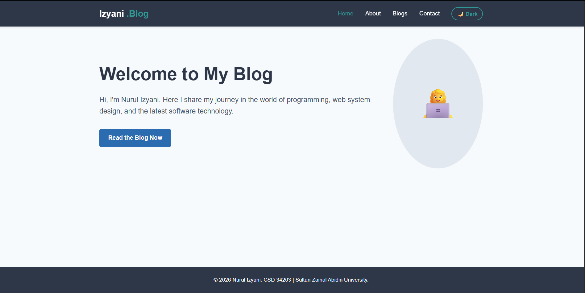

# My Personal Portfolio Blog 🚀

## 📝 Project Description
This website is a personal portfolio blog designed to showcase my digital profile, software development skills, and tech articles. It was developed as an individual assignment for the course **CSD 34203 Special Topics in Software Development** at **Universiti Sultan Zainal Abidin (UniSZA)**. 

---

## ✨ Features
- **Responsive Web Design:** The layout is fully optimized using CSS Media Queries to render beautifully across desktops, tablets, and mobile smartphones.
- **Interactive Dark Mode Toggle:** Features a custom-built theme switcher that allows users to seamlessly switch between light and dark visual themes.
- **State Persistence (Local Storage):** Uses browser storage capabilities to remember the user's preferred theme setting (Light/Dark) even after refreshing the page.
- **Comprehensive Structure:** Built with organized semantic pages including Home, About Me, Blog (featuring 3 sample posts), and a functional Contact layout.

---

## 🛠️ Technologies Used
- **HTML5** – Structures the layout skeleton across all core pages.
- **CSS3** – Manages modern layout grid/flexbox positioning, custom coloring schemes, typography, and mobile responsiveness.
- **JavaScript (Vanilla)** – Powers the conditional logic for the theme switching toggle mechanism.
- **Git & GitHub** – Utilized for source control management, incremental commit logging, and remote repository hosting.

---

## Visuals & Live Demo
🔗 Live Demo Link
The live production deployment of this portfolio blog can be accessed online via GitHub Pages here:
👉 [https://nurulizyani0330.github.io/personal-blog-portfolio/](https://nurulizyani0330.github.io/personal-blog-portfolio/)

## 📸 Screenshots



*Figure 1: The Main Interface (Home Page) on a desktop view.*

---

## 💻 How to Run the Project Locally

1. **Clone this repository to your computer:**
```bash
   git clone [https://github.com/nurulizyani0330/personal-blog-portfolio.git](https://github.com/nurulizyani0330/personal-blog-portfolio.git)