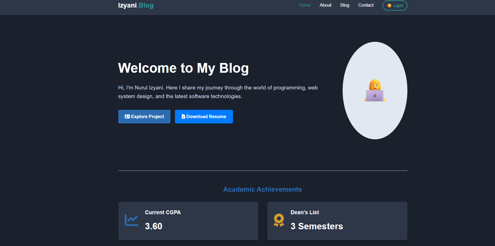
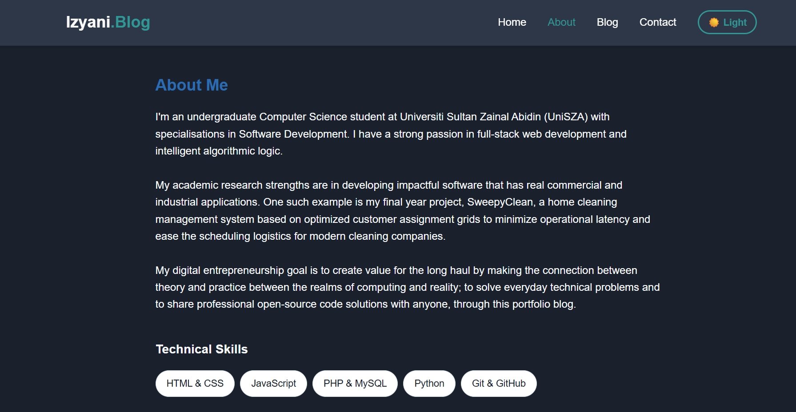
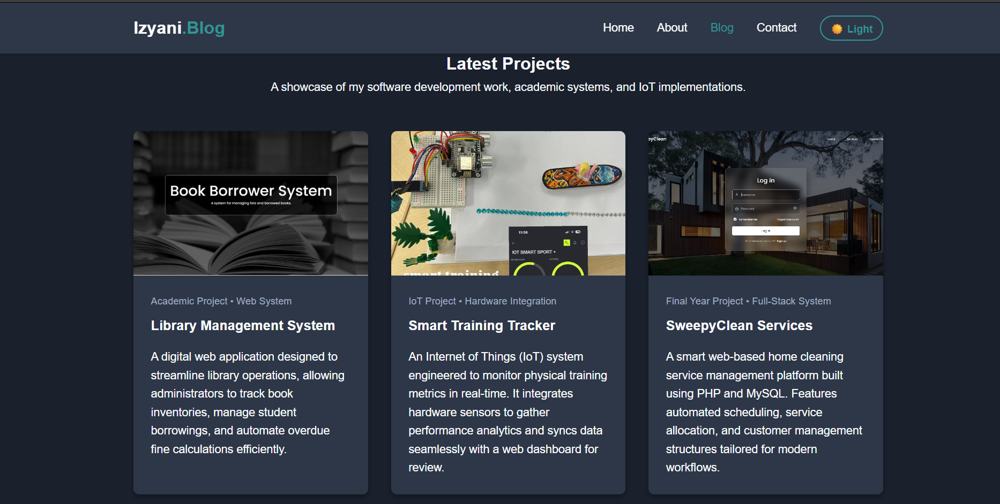
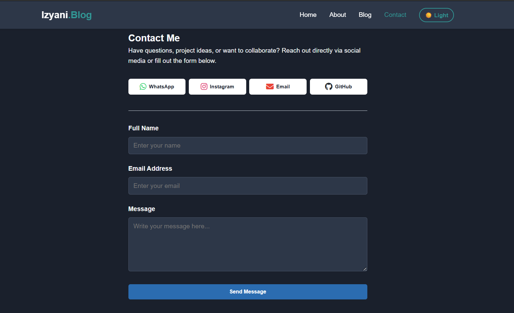

# My Personal Portfolio Blog 🚀

## 📝 Project Description
This website is a professional personal portfolio blog designed to showcase my digital profile, software development skills, and technical academic systems. It was developed as an individual assignment for the course **CSD 34203 Special Topics in Software Development** at **Universiti Sultan Zainal Abidin (UniSZA)**.

---

## ✨ Features

### 🎨 Core Features
- **Responsive Web Design:** The layout is fully optimized using CSS Grid, Flexbox, and Media Queries to render beautifully across desktops, tablets, and mobile smartphones.
- **Interactive Dark Mode Toggle:** Features a custom-built theme switcher that allows users to seamlessly switch between light and dark visual themes.
- **State Persistence (Local Storage):** Uses browser storage capabilities (localStorage) to remember the user's preferred theme setting (Light/Dark) even after refreshing or closing the browser window.
- **Comprehensive Structure:** Built with organized semantic structural pages including Home, About Me, Blog, and Contact layouts.

### 🚀 Advanced Features (Value Creation & Innovation)
- **Dynamic Client-Side Filter:** The Project Blog page features an interactive JavaScript category filter (All Systems, Web System, IoT Project) allowing real-time portfolio navigation without page reloads.
- **Form Interception & Feedback Logic:** The Contact Form overrides default submission behaviors (event.preventDefault()) to handle basic validation, input resetting, and displays a custom animated success notification banner.
- **Media Optimization:** Handled responsive hardware layout scaling using object-fit: contain constraints to ensure technical project hardware images remain uncropped and fully visible.

---

## 🛠️ Technologies Used
- **HTML** – Structures the layout skeleton across all core pages using semantic tags.
- **CSS** – Manages modern layout positioning, interactive hovering states, keyframe animations, dark-theme variables, and mobile responsiveness.
- **JavaScript** – Powers the conditional logic for theme state persistence, dynamic DOM filtering, and form submit event interceptions.
- **Git & GitHub** – Utilized for structural source control management, incremental progress tracking, and remote repository hosting.

---

## 🔗 Live Demo Link
The live production deployment of this portfolio blog can be accessed online via GitHub Pages here:  
👉 [https://nurulizyani0330.github.io/personal-blog-portfolio/](https://nurulizyani0330.github.io/personal-blog-portfolio/)

---

## 📸 Screenshots


*Figure 1: The Main Interface (Home Page) with optimized academic showcase metrics.*


*Figure 2: The About Interface emphasizing real-world industrial optimization goals.*


*Figure 3: The Blog Interface with client-side interactive category filter buttons.*


*Figure 4: The Contact Interface displaying the JavaScript success alert banner configuration.*

---

## 💻 How to Run the Project Locally

Follow these simple steps to set up and run the portfolio blog locally on your development machine:

1. **Clone the repository:**
   ```bash
   git clone [https://github.com/nurulizyani0330/personal-blog-portfolio.git](https://github.com/nurulizyani0330/personal-blog-portfolio.git)